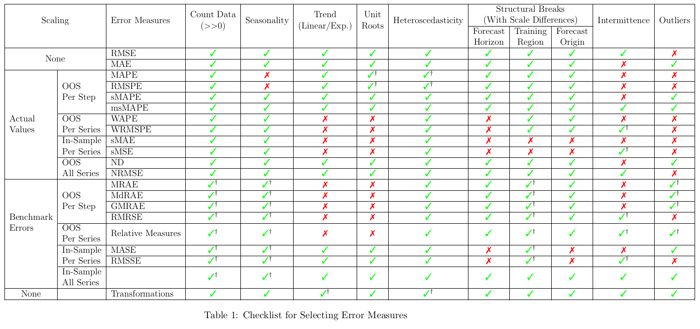

# Introduction

Forecasting is applied across a wide range of domains, each with distinct data characteristics, and there is currently no one-size-fits-all approach to evaluation. This diversity is leading to considerable confusion; in the worst cases, it is used as an excuse to persist with clearly inappropriate or outdated evaluation protocols. The aim of this commentary is to reflect as closely as possible the current consensus within the forecasting community on how (not) to evaluate point forecast accuracy in different scenarios. We also give explicit recommendations for which error measures to use, so that academics and practitioners hopefully are enabled to improve their practices by following the guidance provided here.

<!-- ## Motivating examples of problems -->

We want to start with some motivating examples of problematic practices. The use of MAPE remains common. A frequent justification is along the lines of *``we know this metric has shortcomings, but the business insists on using it.''* 

TODO: Say briefly what the shortcomings of MAPE are. Also say that sMAPE doesn't make things better [@citeTODO].

Many published papers in machine learning research that develop methods for long-term forecasting rely on normalized mean squared error (MSE) or similar metrics **TODO: Cite some papers, give example. Cite my youtube talk?**. This metric is not suitable for many forms of non-stationarity, such as trends, as the denominator will grow (assuming an upward trend), so if the unscaled error stays the same, the scaled error will reduce. Coincidentally, all datasets commonly used in these papers have no or negligible trends, so that the used measures are ok. However, this is usually not discussed in these papers and could therewith easily lead to practitioners using these measures inappropriately on trended series.

More subtle issues are situations where for example MAE or MASE [@citeTODOHyndman2006] are used to compare (machine learning) models trained with an L1 loss with ETS or ARIMA models, which are typically estimated via maximum likelihood and therefore optimized for the conditional mean of the forecast distribution. Such comparisons conflate fundamentally different optimization objectives.

Our focus here is on **point forecasting**. That said, we discuss in Section XYZ that all forecasts are inherently probabilistic, even when only point predictions are reported. Some argue that forecasts should always communicate uncertainty explicitly, for example through prediction intervals. While we agree with this position in principle, we nonetheless restrict the scope of this paper to the evaluation of point forecasts.


<!-- Measures are misused, in practice and in academia. Examples: 

    - ML research in academia. Point to the papers that use some normalised MSE without checking stationarity.
    - Practice (and academia): Use of MAPE is still very common
    "we use XYZ, we know it is not good but the business wants to use this metric". This is not good enough anymore.
    - more sutile: using MAE (or MASE) to compare ML models trained with L1 loss with ETS and ARIMA, that train with Maximum likelihood, therewith for the mean of the forecast distribution.

Forecasting is done in very different domains with very different data characteristics and there is no one-size-fits all approach for evaluation. However, this leads to a lot of confusion, and in the worst situation it is used as an excuse to stick to clearly inappropriate and outdated evaluation protocols.

The aim of this commentary is to represent as closely as possible what is the current consensus among the forecasting community about how to evaluate point accuracy in different scenarios.

We talk here about point forecasting. However, we'll discuss in Section XYZ that forecasts are always probabilistic, even if we do point forecasting. There are people out there that argue that forecasting should always show the spread, e.g., through intervals. While we agree to this in spirit, we will nonetheless focus in this paper on point forecasting.
 -->


TODO: In general, there are two things to consider: 1) Which loss to use, which summary statistic to elicit. And 2) How to normalise. Both aspects depend on the distribution of the time series.

# Q1: Forecasting is always probabilistic, forecasts are never 100% correct and always bear uncertainty.

Forecasting is not like classification of images of cats versus dogs, where you may have nearly no noise in the signal and you may be able to achieve 100% accuracy. Forecasting is fundamentally a probabilistic exercise, and nearly always forecasts will have some irreducible uncertainty inherent to them, which means there typically is a limit to the accuracy you can achieve, no matter your methodology. Furthermore, we always need to consider the forecast distribution, which is the distribution of a currently unknown future value that we aim to forecast. If we now decide to produce a point forecast, that point forecast is best understood as a summary statistic, summarising the forecast distribution into a single value. Straightforward choices for this summary statistic are mean, median, or mode. As such **point forecasts are statistical objects with familiar properties such as bias and variance. Their interpretation depends critically on the criterion used to define optimality.**

## Calculating point forecasts from a forecast distribution: A motivating example, tomorrow's weather forecast

Let's assume we have the following forecast distribution of tomorrow's rainfall: 80% chance: 0 mm, 15% chance: 5 mm, 5% chance: 40 mm. 
TODO: The distribution is visualised in Figure TODO

Which point forecast should we pick? A layman may assume that forecasting intends to produce the most likely future value, which in statistical terms is the mode. In our example, the mode is $0$ mm, i.e., no rain. The median is the 50th percentile, which in our example is again $0$ mm, no rain. The mean comes to $\mathbb{E}[Y] = 0 \cdot 0.8 + 5 \cdot 0.15 + 40 \cdot 0.05 = 3.25\ \text{mm}$.

Forecasting is (almost) always a means to an end, usually for subsequent decision-making. **While the forecast distribution is in principle independent of the subsequent decision, the point forecast is not.**

Coming back to our example, the decision to be made could be whether you should carry an umbrella, put on a light all-weather jacket, or can go with your cord parker. Based on the mode or median point forecast, you may go confidently with your cord jacket and then potentially get soaked, whereas if your decision is based on the mean forecast, you might carry around an umbrella all day that you finally don't need. Let's assume the decision is whether today can finally be the day you should take your Picasso painted in pastel colours around town in an open carriage...

TODO: Talk here a bit about the Bayesian angle of getting the full distribution and that way be independent of the subsequent decision.

## Different error measures are minimal under different summary statistics of the forecast distribution

Let's now assume we did our rainfall point forecast every day for a full week, and we now want to backtest how well our forecast performed. Common choices for error measures would here be RMSE and MAE, that we define as follows:

$$\text{RMSE} = \sqrt{\frac{1}{n}\sum_{t=1}^n(y_t-\hat{y_t})^2}$$
$$\text{MAE} = \frac{1}{n}\sum_{t=1}^n|y_t-\hat{y_t}|$$

They are averaging squared error (SE) and absolute error (AE):
$$\text{SE}_t = (y_t-\hat{y_t})^2$$
$$\text{AE}_t = |y_t-\hat{y_t}|$$

It turns out mathematically (we will not go into the details here) that choosing the mean of the forecast distribution (as opposed to, e.g, the median) leads to the best RMSE, whereas the median leads to the best MAE.

This means that with the choice of error measures, we request a certain summary statistic of the forecsat distribution. And these are not always clear or even well defined, for example the MAPE elicits TODO....

TODO: Picture from @kolassa2020best I have re-created it for my slides, so can take it from the sources of my slides

## In-sample versus out-of-sample performance

Let's assume we have made the decision that we want to evaluate our forecast with, for example, RMSE. This decision is also in general not easy to make, and we'll get back to this in the next section, Section TODO:XYZ.

If we are using a forecasting model that produces a full forecast distribution, like a Bayesian forecasting model such as TODO:CITE or TODO:CITE, this can be straightforward. We just calculate mean or median of the forecast distribution. In non-probabilistic forecasting methods where we do not produce a forecast distribution, this is modelled through the loss function. This again seems straightforward, but there are some caveats, mostly with respect to generalisation. Let's start with the losses and define the following framework.

Let $L(a, y)$ be the loss from predicting $a$ when the outcome is $y$. A point forecast solves:
  $$\hat{y}_{t+h} = \arg\min_{a} \mathbb{E}\!\left[ L(a, Y_{t+h}) \right].$$

Different loss functions in principle target different optimal summaries. For example, using squared error as the loss ($L(a,y) = (a-y)^2$) we target the mean, using absolute error as the loss ($L(a,y) = |a-y|$) we target teh median, and using 0–1 loss, which is one if the forecast is equal to the actual and zero otherwise ($L(a,y)=\mathbf{1}\{a \neq y\}$), we target the mode.
We note that only in the case of the quite uncommon 0–1 loss the point forecast always coincedes with the most likely value.

TODO: generalisation. Examples from the literature where combined losses later improve both RMSE and MAE.
TODO: What Daniel talked about that if the distribution is symmetric but non-normal, using L2 loss can be better, even though you use later MAE...

TODO: So which loss should you be using? Often you have no choice. ARIMA, ETS....Chronos2. If you do have a choice...TODO: How to choose the loss function?

## What is the right measure for you? Should you use different measures together?

Some people argue that by picking a loss you have picked which summary statistic you want to elicit and therefore it makes no sense to use more than one error measure. We want to argue here in a different direction (TODO: This may not be a consensus among the authors):

You may not know which summary statistic and therefore which error measure you actually want. There are some clear-cut examples. For example, if you have an intermittent time series (here, with intermittent we mean over 50% of the values of the series are zeros), using MAE for evaluation will elicit the median of the forecast distribution, which will marginally be a zero, so that your evaluation favors methods that always predict zeros. This is most likely not what you want and you should use RMSE for evaluation instead.

However, very often this is not clear, and you want to just have forecasts that will be suitable for the subsequent decision-making, without having a clear idea whether RMSE, or MAE, or some other measure better approximates your utility function of that decision.

In this situation, using different error measures seems reasonable, to test the robustness of your forecasts.


$\rightarrow$ A model using squared-error loss would forecast **3.25 mm**,  
  even though **0 mm is much more likely**.

$\rightarrow$ 3.25 mm is **not** a "likely" value in the everyday sense.

$\rightarrow$ It is the **mean** of the forecast distribution, chosen to minimize expected squared error.

<!-- This shows why a point forecast is a **decision under a loss function**,  
  not necessarily the most probable future value. -->


## Takeaways

- A point forecast is a **decision**, not "the future".
- It is a **summary statistic** of the predictive distribution:
  - Mean (squared error)
  - Median (absolute error)
  - Mode (0–1 loss)

- Its interpretation depends on the **loss function**.
- Because it’s a statistic, it has **statistical properties**:
  - can be biased/unbiased,
  - has variance,
  - reacts to skewness, heavy tails, etc.


# Q2: How to deal with series on different scales, and non-stationarities, especially trends and level shifts?

## Examples for different scenarios

In the following we discuss some examples of different scenarios that require different evaluation measures.

TODO: use case from retail: intermittent data, versus a use case of aggregated retail, versus financial time series.

### Example for an easy, straightforward case: renewable energy production

TODO: Show a picture

The series has both a meaningful minimum and maximum. Min-max scaling can be used to normalise across, e.g., wind turbines of different sizes. Both normalised MAE or normalised RMSE seem appropriate.

### Example for a non-normal, asymmetric distribution: intermittent retail forecasting

TODO: Show a picture

### Example for strong trends, unknown scale: Bitcoin price data

TODO: Show a picture


# Error measures

* Overviews by @Hyndman2006Another and @Hewamalage2023Forecast
* Still controversial, no solution that always works
* Still papers that come up with their own ad-hoc measure
* Measures often misused

## Scale-dependent errors and error measures

\small

Scale-dependent errors: squared error (SE), absolute error (AE):
$$\text{SE}_t = (y_t-\hat{y_t})^2$$
$$\text{AE}_t = |y_t-\hat{y_t}|$$

Corresponding error measures, e.g., RMSE and MAE:
$$\text{RMSE} = \sqrt{\frac{1}{n}\sum_{t=1}^n(y_t-\hat{y_t})^2}$$
$$\text{MAE} = \frac{1}{n}\sum_{t=1}^n|y_t-\hat{y_t}|$$

### RMSE

  - MSE is equal to Bias$^2$+Var, so if model is unbiased, RMSE and standard dev of the error are the same
  - is minimised by predicting the mean of the forecast distribution
  - penalises large errors more heavily
  - minimising RMSE leads to (mean-)unbiased forecasts

### MAE

  - sometimes also called mean absolute deviation (MAD)
  - is minimised by predicting the median of the forecast distribution
  - more robust to outliers and large errors
  - minimising MAE can lead to (mean-)biased forecasts if forecast distribution is skewed
  - for series with small integer values, minimising MAE will lead to predictions that are small integers (as median of forecast distribution is an integer)
  - for intermittent series, minimising MAE can lead to predicting only zeros, and heavily biased forecasts towards underprediction, as median of the forecast distribution is zero.


### Scale-dependent error measures: RMSE and MAE

- Advantages: Are on the same scale as the data, are interpretable
- Problem: If series are on very different scales, some series can dominate the evaluation
- We need a scale-free measure.
- We need to divide by "something"
- After 30 years of research in forecasting, we have still not found this "something" in a way that it works under any possible non-stationarity and series characteristics.
- There are over 40 error measures proposed in the literature that we are aware of  (sMAPE, MASE, etc.)


### Problems: Non-stationarity, Non-normality

<!-- Talk on this slide also about the different scales of the series -->

```{r echo=FALSE, fig.width=12, fig.height=4, out.width="100%", out.height="20%"}
plot(AirPassengers)
```

```{r echo=FALSE, fig.width=12, fig.height=4, out.width="100%", out.height="20%"}
set.seed(3)
plot(cumsum(rnorm(1000))+10, type="l", ylab="Price")
```

```{r echo=FALSE, fig.width=12, fig.height=4, out.width="100%", out.height="20%"}
library(fpp2)
plot(elecdemand[3000:6000,"Demand"]*1000, type="l", ylab="Electricity demand")
```

```{r echo=FALSE, fig.width=12, fig.height=4, out.width="100%", out.height="20%"}
set.seed=5
plot(rpois(200, lambda = 0.5), type="l", ylab="Sales")
```


## scaled errors: MAPE


### Percentage Errors (PE)

$$\text{PE}_t = 100\ \frac{y_t-\hat{y_t}}{y_t},\ \ \ \ \text{MAPE} = \frac{1}{n}\sum_{t=1}^n \left|100\ \frac{y_t-\hat{y_t}}{y_t}\right|$$

- Problem: Cannot be used if $y_t$ is zero and is distorted when $y_t$ is small. Was originally used for inventory count data.
- Is also not symmetric: exchanging the prediction and the true value changes the result
- Is minimised by the "(--1)-median" of the forecast distribution

### 50% of error can have very different consequences

MAPE tends to focus more on the series with small values as they tend to have large errors

```{r echo=FALSE, fig.width=12, fig.height=4, out.width="100%", out.height="20%"}
plot(AirPassengers)
```

```{r echo=FALSE, fig.width=12, fig.height=4, out.width="100%", out.height="20%"}
library(fpp2)
plot(elecdemand[3000:6000,"Demand"]*1000, type="l", ylab="Electricity demand")
```

```{r echo=FALSE, fig.width=12, fig.height=4, out.width="100%", out.height="20%"}
set.seed=5
plot(rpois(200, lambda = 0.5), type="l", ylab="Sales")
```


### Solution: symmetric MAPE (sMAPE)

$$\text{sMAPE} = \frac{1}{n}\sum_{t=1}^n \left|100\ \frac{y_t-\hat{y_t}}{\frac{|y_t|+|\hat{y_t}|}{2}}\right| = 200 \frac{1}{n}\sum_{t=1}^n \left| \frac{y_t-\hat{y_t}}{|y_t|+|\hat{y_t}|}\right|$$

\footnotesize

- Achieves symmetry from before, but breaks another symmetry: overprediction is penalised less than underprediction (as dividing by the prediction)
- Still has problems with zeros; if both actual and prediction are zero, it is not defined
- If there is a zero in the data and we don't predict an exact zero, the sMAPE is maximal. 
- This has large implications for intermittent data: If you use sMAPE to evaluate intermittent forecasts, your main concern will be to predict zeros as exact zeros.
- Big advantage: sMAPE is bounded by 200, will never go higher.

<!-- Also, if $y_t = 0$ -->
<!-- $$\left| \frac{y_t-\hat{y_t}}{|y_t|+|\hat{y_t}|}\right| = \left|  \frac{\hat{-y_t}}{|\hat{y_t}|}\right| = 1, \text{ if } \hat{y_t} \neq 0$$ -->

### modified sMAPE [@Suilin2017kaggle]

$$\text{msMAPE} = 200 \frac{1}{n}\sum_{t=1}^n \left| \frac{y_t-\hat{y_t}}{max(|y_t| + |\hat{y_t}| + \epsilon, 0.5 + \epsilon)}\right|$$
With a default of $\epsilon = 0.1$

- ad-hoc solution for problems with zeros and small values
- will make the evaluation skewed and is not minimised by any meaningful summary statistic of the forecast distribution

<!-- ### Mean Arctangent Abs. Percentage Error (MAAPE)

$$\text{MAAPE} = \frac{1}{n}\sum_{t=1}^n arctan \left(\left|\frac{y_t-\hat{y_t}}{y_t}\right|\right)$$

- Proposed by @Kim2016new
- Authors argue it is as interpretable as MAPE
- Advantage: It is $\pi/2$ instead of $\infty$, when $y_t$ is zero 
- Has the same problem as sMAPE that if $y_t$ is zero, it always is maximal, no matter what $\hat{y}_t$ is
- Therefore, not good for intermittent data


 -->


## scaled measures: WAPE, normalised MSE, etc.

* Only use them if data is stationary, e.g., intermittent series. 
* TODO: What about data that is seasonal but has no trend?


### Weighted (Mean) Absolute Percentage Error (WAPE)

$$\text{WAPE} = \frac{\sum_{t=1}^n\left|y_t-\hat{y}_t\right|}{\sum_{t=1}^n \left|y_t\right|}$$

- @Belt2017When and @Kolassa2007Advantages argue for this measure to be used in demand forecasting
- Called "weighted" as MAE can be seen as a weighted (scaled) version of MAPE
- WAPE is also called MAD/mean ratio (if all actuals are non-negative)

### Squared and bias error measures

Weighted Bias Percentage Error (WBPE):
$$\text{WBPE} = \frac{\sum_{t=1}^n\left(\hat{y}_t-y_t\right)}{\sum_{t=1}^n y_t}$$

Weighted Root Mean Squared Percentage Error (WRMSPE):

$$
\text{WRMSPE} = \frac{\sqrt{\sum_{t=1}^n\left(y_t-\hat{y}_t\right)^2}}{\sum_{t=1}^n \left|y_t\right|}
$$

As discussed before, WRMSPE measures for an unbiased model the standard deviation 

### Squared and bias error measures (2)

- In retail/e-commerce, it is beneficial to monitor both bias and overall error. 
- If one overall number needs to be measured, practitioners have proposed to use WAPE+WBPE

<!-- ## Error measures (3) -->

<!-- Show example from the LS-Net paper. -->

<!-- @Lai2018Modeling -->

<!-- Root Relative Squared Error (RSE), Empirical Correlation Coefficient (CORR) -->

### Calculating WAPE/WRMSPE per series and across series
 
\footnotesize
 
- In the WAPE, we divide by $\sum_{t=1}^n \left|y_t\right|$
- This sum can run over each series individually or over all series
- Running over all series:
  - \footnotesize  It is now an MAE (i.e., a scaled measure) globally scaled to be a percentage
  - Essentially same as MAE, but slightly more interpretable
  - As in MAE, series with higher values get more importance in the error
- Running per series:
  - \footnotesize  Scale-free
  - Only works if we have more than one forecast, otherwise same as MAPE
  - If the whole test set is zero, we divide by zero

### Advantages and disadvantages of WAPE/WRMSPE

Advantages:   

  - Only divides by zero if whole test set is zero
  - Minimised by the median of the forecast distribution
  - Interpretable as a percentage

Disadvantages:

  - Only consistent estimator when series is stationary [@Hyndman2025WAPE]
  - Can be seen as RelMAE where benchmark method is a constant zero: works well if a constant zero is a reasonable benchmark


## Using a benchmark: RelMAE

* benchmark has to be adequate, if performance of benchmark varies widely, the measure will change even though our forecast errors stay the same.

WAPE can be seen as having a constant zero as the benchmark. Use when a constant zero is an adequate benchmark.


### Relative errors and error measures

Use a benchmark method $B$ (usually the naive forecast)

Relative Errors:
$$\text{RE}_t = \frac{y_t-\hat{y_t}}{y_t-\hat{y}_{tB}},\ \ \ \ \text{MRAE} = \frac{1}{n}\sum_{t=1}^n \left|\frac{y_t-\hat{y_t}}{y_t-\hat{y}_{tB}}\right|.$$
$\rightarrow$ Same problems as before, if true values are zero and predictions from the benchmarks are zero, etc.

Relative Error Measures:
$$\text{RelMAE} = \frac{\text{MAE}}{\text{MAE}_B}.$$
Only has benefits if we are evaluating many predictions on the same scale. If series on different scales and only one forecast per series, it has the same problems as before.


## Using a benchmark over the training set: MASE, RMSSE

- is MASE/RMSSE interpretable?

### Mean Absolute Scaled Error (MASE)

- Proposed by @Hyndman2006Another
- Defined as the MAE divided by the MAE of the (seasonal) naive forecast over the training part of the time series.

$$\text{MASE} = \frac{\sum_{t=1}^{n} |\hat{y}_{t} - y_{t}|}{\frac{n}{m - s}\sum_{k=s+1}^{m} |y_{k} - y_{k - s}|}$$

- RMSSE: Equivalent with squared errors
- Used in the M5 competition

$$\text{RMSSE} = \sqrt\frac{\sum_{t=1}^{n} (\hat{y}_{t} - y_{t})^2}{\frac{n}{m - s}\sum_{k=s+1}^{m} (y_{k} - y_{k - s})^2}$$

### MASE and RMSSE: Advantages

Resolve many problems that other measures have:

  - are minimised by the mean/median of the forecast distribution
  - are scale-free
  - hardly any problems with zeros or intermittency
  - cope well with many types of non-stationarity 
    - remainder of the benchmark needs to be stationary for estimator to be consistent
    - when using naive: series needs to be difference stationary
  - Interpretation: If MASE $<1$, forecast is on average better than naive

### MASE and RMSSE: Problems

\footnotesize

  - As with other measures, MASE/RMSSE depend on how meaningful the chosen benchmark is
  - The naive forecast works a lot better on certain (smooth) series than on others. 
  - Different benchmarks in use (naive, seasonal naive, could also use more complex methods like ARIMA, SES, etc.)
  - Difficult to choose benchmark with fixed origin forecasting: many different horizons are in use
  - Series can have significant changes between training and test set
  
  $\rightarrow$ In practice often difficult to interpret
  
  $\rightarrow$ High or low MASE is not necessarily equivalent with good or bad (absolute) performance.

### Examples for problems with MASE/RMSSE

<!-- TODO -->

### Should you use MASE or RMSSE?

- Why did the original authors propose MASE and not RMSSE? 
  - Original paper proposed MASE to stay close to MAPE so that people would switch
  - Idea was that MASE was easier to understand and more likely to be adopted
  - No big difference between MASE and RMSSE for classical models that assume Gaussian errors
- RMSSE adequate in many more situations than MASE (equivalent to a discussion RMSE vs MAE)


# Calculating error measures per series and across series

TODO: Show a picture

TODO: Exlain the 3 dimensions. Should this come before or after the error measures?

Three dimensions along which we can potentially aggregate:
* horizons
* rolling origins
* different time series

Each dimension can collapse: only one horizon, only one origin, only one time series. This can cause problems with divisions by zero, small numbers, and others.

* We want to aggregate and divide by a normalising factor
* If we divide first, we have problems with division by zero and numerical instability
* If we aggregate first, we need to make sure that what we aggregate is on the same scale
* That usually means we don't want to aggregate from different series before normalising.
* Already within a single series there can be problems (see the WAPE)


# Recommendations

There is no one size fits all. 

If you are an academic: use RMSSE
If your series are intermittent: do XYZ ...

TODO: If you are an academic, clearly say what type of forecasting you are addressing. Do not just say "forecasting". Try to be specific. Say for example: seasonal series without trends.

## Error measures: Summary




## Error measures: Summary (2)

- To get a scale-free measure, we need to divide by a normalising factor
- Due to the potential non-stationarity and non-normality (e.g. intermittency) of the series, it has turned out to be extremely difficult to do this in a way that always works
- Today, the RMSSE and MASE are standard error measures, e.g., in the recent M5 competition
  - but have problems with structural breaks between training and test set
  - may not be interpretable, especially with long horizons / fixed origins
- It depends on the characteristics of your data which measure will be adequate

## Error measures: Recommendations

- If you currently use the MAPE or sMAPE, switch to something else
- Do not invent your own measure, it will be more difficult than you think
- Some people (S. Kolassa) argue against using multiple measures
- Different measures are minimised by different summary statistics over the forecast distribution
- My take: choose a primary metric (RMSSE) that coincides with your loss function (L2)
- And then using the others for sanity-checking seems reasonable 

## Error measures: Recommendations (2)

- When building a global model, often the series have meaningful scales (SKUs, dollars, ...)
- If you don't need a scale-free measure, better stick to MAE, RMSE

## Error measures: Recommendations (3)

If you need a scale-free measure:

  - if you will benchmark different methods broadly to conclude which one is best and you don't need interpretability
    - this is the standard scenario for scientific papers about forecasting methodology
    - use RMSSE
    - use MASE only if there are reasons to elicit the median of the forecasting distribution, and if all your compared methods use this loss
    - if you evaluate over a mix of methods, some trained with L1 loss, some with L2 (or similar): report both MASE and RMSSE

## Error measures: Recommendations (4)

If you need a scale-free measure and interpretability:

  - use WAPE, WRMSPE, WBPE; proceed with caution
  - WAPE, WRMSPE, WBPE could also be normalised with a sum over the training set instead of the test set (??)
  - use RMSSE/MASE but with the denominator running over the test set if horizons are long, and with the same (fixed-origin) setup for your benchmark method (??)


# References {.unnumbered}

::: {#refs}
:::

\newpage

\appendix

# References to add

- Rob's paper 2006
- Foresight paper Ivan
- Davydenkov and Fildes, 2013
- Ivan's book: https://openforecast.org/adam/errorMeasures.html


# Appendix 1: Old stuff


Ivan recommends to both use mean and median:  "both the mean and median of the chosen metric"


Forecasting is fundamentally a probabilistic exercise. When we predict a future value ( y_{t+h} ), we are not truly predicting a single number, but rather a full predictive distribution that reflects uncertainty about future outcomes given the information available at time ( t ). A point forecast is therefore best understood as a summary statistic of this distribution. Importantly, this summary is not inherently the “most likely future value.” Instead, it is the value that is optimal under a specific loss function, that is, the value that minimizes expected loss with respect to the predictive distribution. Seen this way, point forecasts are statistical objects with familiar properties such as bias and variance, and their interpretation depends critically on the criterion used to define optimality.

Different loss functions lead to different optimal point forecasts because they emphasize different aspects of forecast errors. Under squared error loss, the optimal forecast is the mean of the predictive distribution, which explains why many standard forecasting methods implicitly target expected values. Under absolute error loss, the optimal forecast becomes the median, offering greater robustness to outliers and skewed distributions. Only under 0–1 loss does the optimal forecast coincide with the mode, the value with the highest probability or density. This distinction clarifies why the common phrase “most likely future value” is often misleading in practice: unless a mode forecast is explicitly targeted, most point forecasts are not modes. Mean, median, and mode coincide only in special cases such as symmetric, unimodal distributions. Consequently, interpreting or evaluating point forecasts always requires asking an essential question: which loss function—and therefore which summary of the predictive distribution—is being implicitly or explicitly used?


TODO: Add stuff from Daniel. What if you don't know which loss is more relevant for your application? Could also say that in Bayesian procedures this becomes very explicit.

 ## Which summary statistic do you want to elicit?


## Point forecasts are probabilistic!

- When we forecast a future value $y_{t+h}$, we are really forecasting its **distribution**:
  $$p(y_{t+h} \mid \text{information at time } t).$$

- A **point forecast** $\hat{y}_{t+h}$ is a **single-number summary** of this distribution.

- It is **not necessarily** the "most likely future value,"
  but the value that is **optimal under a chosen loss function**.

- So a point forecast is a **statistic** of the forecast distribution,
  and therefore has **statistical properties** (bias, variance, etc.).


## The "most likely future value": the mode

- The phrase **"most likely future value"** corresponds to the **mode** of the forecast distribution:
$$\text{mode}(Y_{t+h}) = \arg\max_y \; p(y \mid \text{information at time } t).$$

- The **mode** is the forecast distribution’s *peak*:
  - the value with the highest probability mass (discrete case), or 
  - the highest density (continuous case).

## But typical point forecasts are *not* modes

- Most classical forecasting methods (ARIMA, ETS, regression) produce **mean forecasts**, not mode forecasts.
- These coincide only under *symmetric, unimodal* predictive distributions (e.g. Gaussian), where:
  $$\text{mean} = \text{median} = \text{mode}.$$

$\rightarrow$ Always think "what loss function is implicit here?" when interpreting or evaluating point forecasts.


# Appendix: Slides 2


## Back to the basics: Measuring variance, bias


## Measuring variance, bias (2)

- Bias and variance have different consequences for a business (to always underpredict may lead to having always stockouts)
- Bias can be measured with the mean error:

$$
	\textit{ME} = \frac{1}{n}\sum_{t=1}^{n} (y_t - \hat{y_t})
$$

- If $\textit{ME}>0$, model underpredicts on average, it is negatively biased
- If $\textit{ME}<0$, model overpredicts on average, it is positively biased
- Thus, bias is $-ME$

## Measuring variance, bias (3)

- We can measure the variance as:

$$
\text{Sample Variance} = \frac{1}{n-1}\sum_{t=1}^n\left((y_t-\hat{y}_t)-mean(y_t-\hat{y}_t)\right)^2
$$

- If we assume the true population mean is zero (there is no bias):

$$
\text{Error Std Dev} = \sqrt{\frac{1}{n}\sum_{t=1}^n\left(y_t-\hat{y}_t\right)^2}
$$


